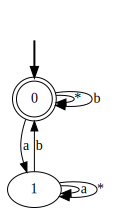

# LTL<sub>p</sub>2DFA
A tool to convert formulae of Linear Temporal Logic on Process Trace into Finite-State Automata

## Links
- https://codeocean.com/capsule/2735129/tree/v1 (to run in the cloud)

## Install
```
sudo apt-get install graphviz
pip3 install flloat
```

## Run
- Example:
```
python LTL<sub>p</sub>2DFA.py 'G(a -> F(b))'
```

## Output
* The program:
    * prints in the terminal the (transition function of the) automaton,
    * creates a DOT file,
    * visualizes it in the DFA.svg file.
* The automaton of the example is:

<p align="center">
  
</p>
